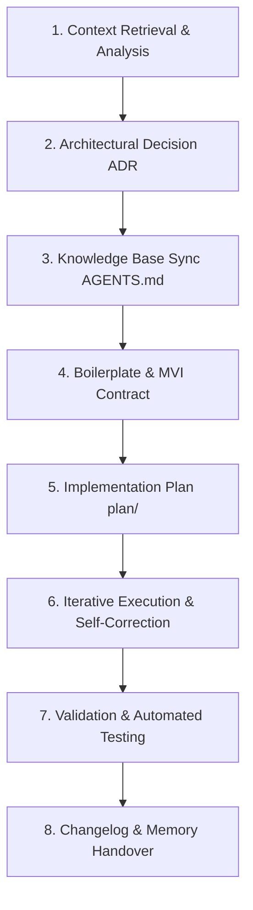

# 🤖 AI-Assisted Development Workflow

This document outlines the standard 8-step workflow for collaborating with AI agents in **Robithoh App**. This disciplined process ensures architectural consistency, zero regressions in sacred texts, and verifiable quality.

---

## 🔄 The 8-Step Workflow Lifecycle

---

### Phase 1: Context Retrieval & Analysis
* **Objective**: Thoroughly investigate existing code, tests, and domain requirements before proposing any changes.
* **Agent's Actions**:
  * Examine relevant files in `shared/src/commonMain/kotlin/com/iqbalwork/robithoh/`.
  * Read existing unit tests in `shared/src/commonTest/` to understand existing contracts and expectations.
  * Check `.agents/memory/STATE.md` for active session context and recent changes.

### Phase 2: Architectural Decision (ADR)
* **Objective**: Document any significant structural change, new feature, or refactoring in `.agents/adr/` **BEFORE** touching code.
* **Agent's Actions**:
  * Draft an ADR following the format: Status, Context, Decision, Consequences.
  * Review against `references/CODE_CONVENTIONS.md` and `references/OFFLINE_FIRST.md`.

### Phase 3: Knowledge Base Synchronization
* **Objective**: Ensure the AI's index reflects the latest project state.
* **Agent's Actions**:
  * Register new ADRs, skills, or major module additions in `.agents/AGENTS.md`.

### Phase 4: Boilerplate & MVI Contract Generation
* **Objective**: Establish strict Unidirectional Data Flow (UDF) boundaries.
* **Agent's Actions**:
  * Define `*UiState`, `*UiIntent`, and `*UiEffect` inside `*Contract.kt`.
  * Build or update the corresponding `*ViewModel.kt` handling intents predictably.

### Phase 5: Implementation Planning
* **Objective**: Produce a granular, sequenced task plan.
* **Agent's Actions**:
  * Save the plan in `.agents/plan/<feature-or-fix-name>.md`.
  * Sequence tasks logically: 1. Core / Database, 2. Domain / Repository, 3. MVI / Presentation, 4. UI Composables, 5. Unit Tests.

### Phase 6: Iterative Execution & Self-Correction
* **Objective**: Write clean, surgical, and production-ready code.
* **Agent's Actions**:
  * Implement logic adhering to Clean Architecture.
  * Strictly separate `*Screen` (state hoisting & effect observer) from `*Content` (stateless UI).
  * Use strings from `strings.xml` or Markdown files; do not leave hardcoded Indonesian/Arabic text.

### Phase 7: Validation & Automated Testing
* **Objective**: Empirically verify that changes compile and pass tests.
* **Agent's Actions**:
  * Run `.agents/tools/verify_build.sh` (or `./gradlew :shared:allTests`).
  * Add unit tests in `commonTest` for any new ViewModel or Repository logic.
  * If UI flows were changed, verify or update corresponding Maestro flows in `.maestro/`.

### Phase 8: Changelog & Memory Handover
* **Objective**: Maintain a reliable historical record for the next agent session.
* **Agent's Actions**:
  * Record all modifications in `.agents/changelog/AI_CHANGELOG.md`.
  * Update `.agents/memory/STATE.md` with current status, completed tasks, and upcoming work.
